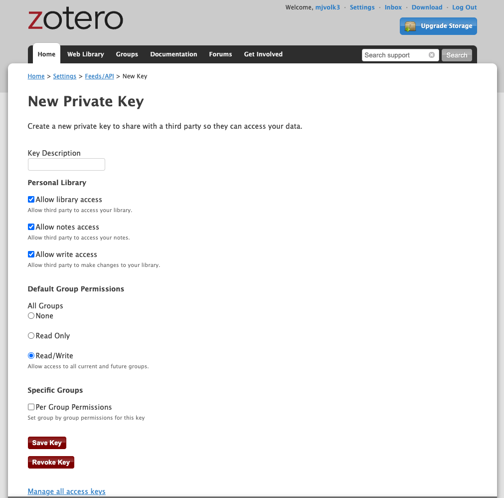

# Zendron

Version: 1.1.0

## Introduction

- This package was developed for porting Zotero annotations and metadata to markdown. These markdown notes are then brought into a [Dendron](https://www.dendron.so/) hierarchy for integration with vault notes. We recommend using the package within [Visual Studio Code](https://code.visualstudio.com/).The end goal is to get a two way sync between notes in Zotero and notes in Dendron, but this has some difficulties and limitations that are taking some time to address. For now only a one way sync from Zotero to Dendron is supported.

## Install Instructions

- It is recommended to build a [conda env](https://conda.io/projects/conda/en/latest/user-guide/tasks/manage-environments.html) for installation.
- Install [Dendron CLI](https://wiki.dendron.so/notes/RjBkTbGuKCXJNuE4dyV6G/).
  - `npm install -g @dendronhq/dendron-cli@latest`
- Install the zendron
  - `python -m pip install zendron`

## Zotero API key

- [Zotero API key](https://www.zotero.org/settings/keys)
- We recommend setting up you Zotero API key with the following settings to allow for full functionality. This key can then be copy pasted in the configuration file. You should add your key to `.gitignore` to prevent others from accessing your Zotoero database. If the key is lost you can always generate a new one.


## Zotero and File Import Configuration

All zendron configuration is handled in [config.yml](https://github.com/Mjvolk3/Zendron/blob/main/conf/config.yaml).

```yml
library_id : 4932032 # Zotero library ID
library_type : group # [user, group] library
api_key : FoCauOvWMlNdYmpYuY5JplTw # Zotero API key
collection: null # Name of Zotero Collection, null for entire library
item_types: [journalArticle, book, preprint, conferencePaper, report] # List of item types according to [pyzotero](https://pyzotero.readthedocs.io/en/latest/)
local_image_path: /Users/<username>/Zotero/cache # Local path for importing annotated images
dendron_limb: zendron.import # Dendron import limb e.g. zendron.import.paper-title.annotations.md
zotero_comment_title: zendron comment # fixed for now... needed for eventual 2-way sync.
pod_path: zotero_pod # Name of dendron pod, removed after completion of import. We will later add configuration for this to remain. This will allow for non Dendron users to import markdown Zotero notes in a strucutred hierarchy.
```

## Basic Usage

There are only two basic commands that work as of now.

- `zendron`
  - This command should only be run in the root directory of the workspace.
  - This command imports notes according to a defined [config.yml](https://github.com/Mjvolk3/Zendron/blob/main/conf/config.yaml). Once the command is run the first time the user needs to modify their configuration `./conf/config.yaml` according the Zotero library specifications and the Zotero API.
  - Notes are imported with a `## Time Created` heading. This allows for stable reference from other notes, within the note vault. We autogenerate a `*.comments.md` that should be used for taking any additional notes within Dendron. Additional notes taken within the meta data file (`notes/zendron.import.<paper-title>.md`), or the `*.annotations.md` will be overwritten after running `zendron` for a second time.
- `zendron remove=true`
  - This command removes all imported notes and associated links. We run a `createMissingLinkedNotes` following the deletion of Dendron notes to repopulate `tags` and `users` that will be removed on running `zendron-remove`.
  - There are more complicated removal's that could be desired so we plan to eventually change this from a `bool` to an `str`.

## Miscellaneous

- The `zendron_cache` is not currenlty in use. We do an entire relaod each time, so for large libraries performance will be poor.
  - You an feel free to delete the cache as you please.
- If there are run that fail, sometimes a `.hydra` with the given configuraiton will be generated in the root dir. This isn't an issue but it contains the API information and should therefore be added to the `.gitignore` as a safeguard. In addition these files can be used to inspect the reason for the faiure.
- `__main__.log` is generated after running a `zendron`, this can also be deleted as you please. It is also useful for inspecting an failures to import.

## Troubleshooting

- If you are having trouble with startup you can use this [Zendron-Test](https://github.com/Mjvolk3/Zendron-Test) template and try to reproduce your issues here. Simply click on `Use this template`, clone the repo and try to run `zendron` here. This will allow for us to catch things we overlooked for different user workspace configuration etc. Once you have tried to reproduce issues here please submit an issue on [Zendron](https://github.com/Mjvolk3/Zendron).
