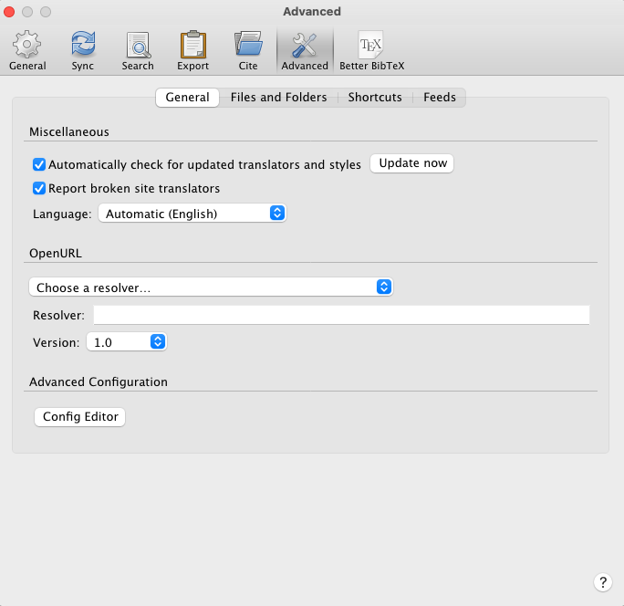
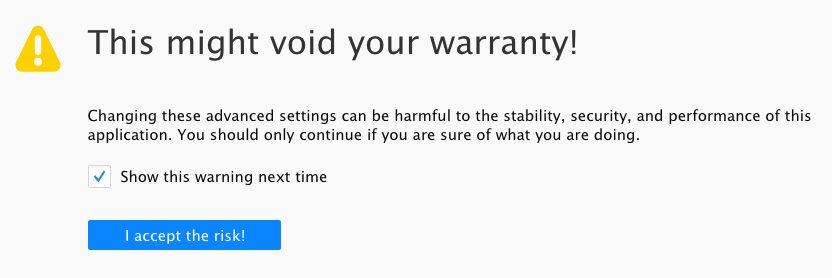

## Extras

### AutoPinDelay

- Change [AutoPinDelay](https://retorque.re/zotero-better-bibtex/installation/preferences/hidden-preferences/) to automatically pin the citation key (add to extras) upon importing
  - Change integer to 1

#### Steps

- (1) 
- (2) 
- (3) Search for `autoPinDelay` and change the integer value from `0` (default) to `1`.

### Citation Counts

- This doesn't conflict with [Zotero Citation Count Manager](https://github.com/eschnett/zotero-citationcounts). It just appends the pinned citation key.

### Manual Pin

- Highlight the entry and select manual pin to add the citation key to extras
  - 
- This will need to be once after chaning the AutoPinDelay setting to 1

## Better BibTex Automatic Export

- This is the first version
